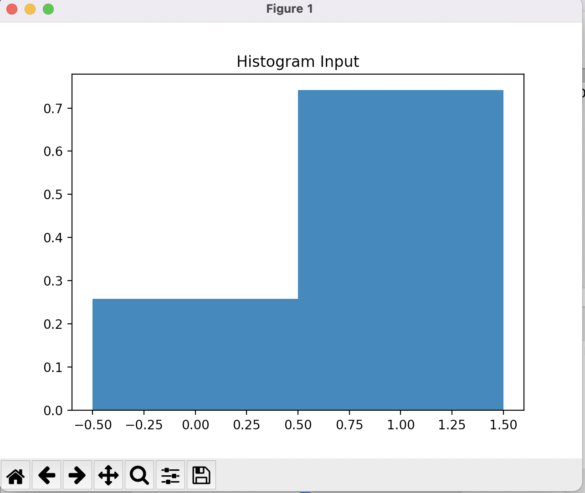
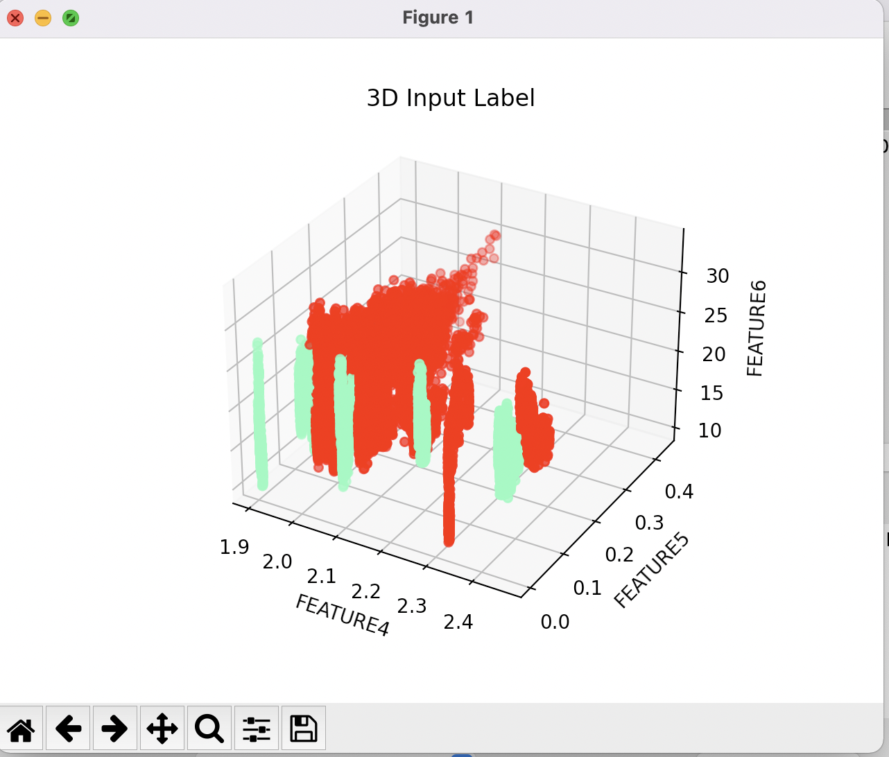
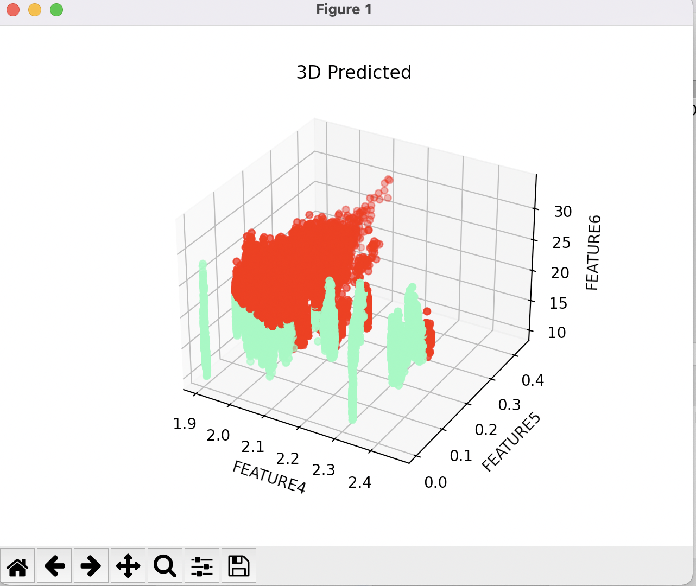

# MachineLearningGUI
An interface to test the performance of different Seiskit Machine Learning algorithm (run time versus training and test score)
My main goal is showing an area of interest. I developed this several years ago, after taking Dr. Ng's training available from coursera. Since then, I have taken more advanced courses and developed new skills. I am currently transferring this code to Javascript html, the tkinter seems to limited. However, this could still be a good starting point to develop and app that can be made portable with Docker. 
How to run:
1) Input the Training (labeled data set)
2) Input the application data set, a sample which has not been labeled for which you want to predict the label
3) The initial intention was havig a level of flexibility to allow for averaging of properties in a gather or collection, say for example, all alumni from a school, rather than looking at each student seaprately. This is activated via gather average click
4) bull in the name of the feature into the columns x1, x2, x3 and the labels. Provide the numer of labels. For example if the labels are are blue/red/yellow/green then use 4, if 0/1 then use two. This part is for visualization purposes and can be changed for different 3D or 2D visualizations via scatter plots. The hisograms are limited to the labels only, for now.  
5) Move the slideing bar to divide the training examples into a training and a cross validation dataset. This will allow obtaining two scores, the training score and the xvalidation with examples that were not use to create the previctive model. 
6)  It is recomended to use normaliation to improve performance. 
7)  You may choose to activate every column to use all features. At the moment, there is no option to select more than just 3 input feature and less than all. 
8)  Use the method menu to selct the Sklearn algorithm and click on Run ML Alg to measure its performance and run time. 
9) Refer to the pictures for examples

Histograms

3D Scatters

